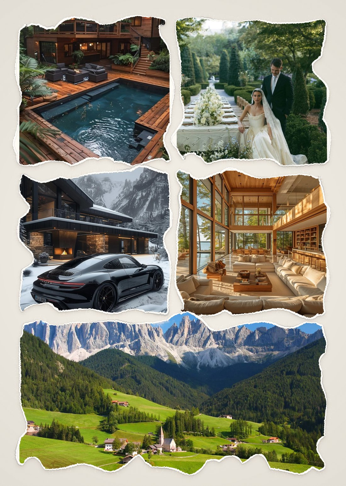
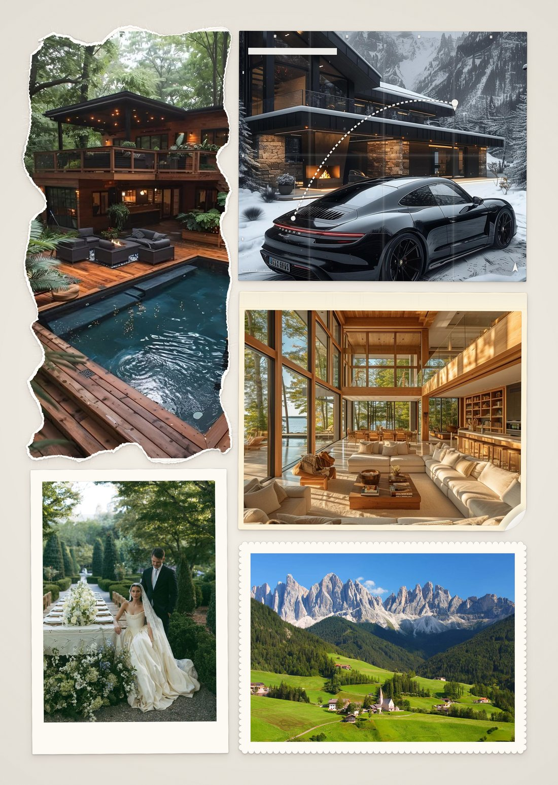

# Vision Board

O projeto Vision Board serve para permitir que você construa seu próprio "Quadro dos Sonhos" e pratique a visualização do futuro que almeja e dos bens que deseja construir.

| | |
|:--:|:--:|
|  |  |

As duas imagens acima usam exatamente as mesmas fotos — o que muda é o arranjo, o formato dos recortes e os detalhes decorativos. Ambas foram exportadas em A3 (297×420 mm) a 300 dpi, prontas para a gráfica.

## Testar sem instalar nada

O projeto está publicado no GitHub Pages e roda inteiro no navegador:

**https://deepoctupus.github.io/vision-board-print/**

Suas fotos não são enviadas para lugar nenhum — todo o processamento e a exportação acontecem na sua própria máquina.

## Como rodar

Rodar o projeto localmente é bem fácil e rápido: basta ter o Python instalado em sua máquina e executar, dentro da pasta com o projeto, o comando que abre um servidor local.

```bash
python -m http.server 8000
```

Você pode trocar o `8000` pela porta que quiser.

## Customização

O projeto fornece toda a estrutura necessária para uma customização avançada do seu Quadro dos Sonhos:

- bordas temáticas de diversas categorias;
- customização individual de imagens, com filtros;
- fundos personalizados;
- e muito mais.

## Impressão

O projeto também fornece a opção de exportar no formato ideal para enviar para a gráfica e imprimir na melhor qualidade possível.

## Atualizações futuras

Este projeto ainda não conta com filtros avançados de imagens, escrita de texto e desenho livre. Tais funções serão adicionadas em atualizações futuras, junto com:

- a possibilidade de adicionar bordas personalizadas e aplicá-las em todas as suas imagens;
- o compartilhamento do seu vision board nas redes sociais.
